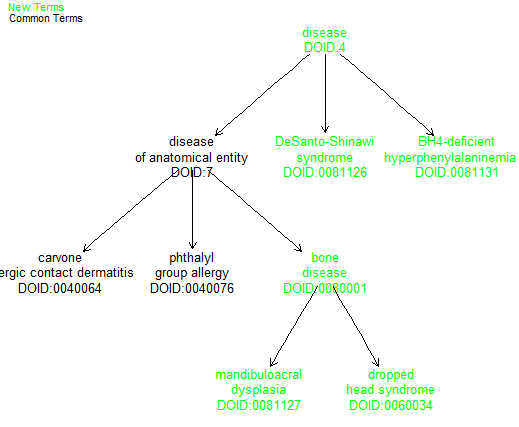
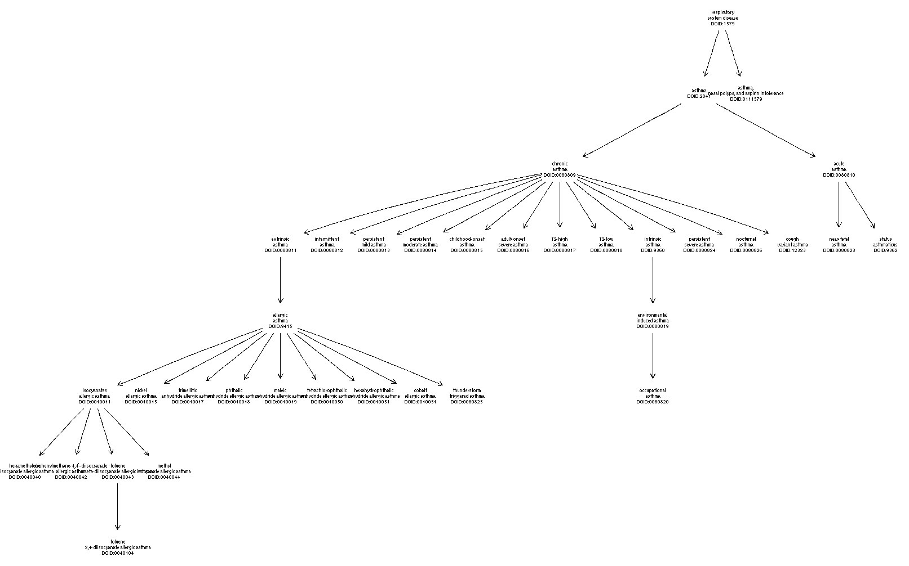

```{r setup,echo=FALSE,results="hide",message=FALSE}
library(knitr)
library(ontoProc)
```

# Introduction

The ambitions of collaborative single cell biology will only be achieved through the coordinated efforts of many groups, to help clarify cell types and dynamics in an array of functional and environmental contexts. The use of formal ontology in this pursuit is well-motivated and research progress has already been substantial.

@Bakken2017 discuss "strategies for standardized cell type representations based on the data outputs from [high-content flow cytometry and single cell RNA sequencing], including 'context annotations' in the form of standardized experiment metadata about the specimen source analyzed and marker genes that serve as the most useful features in machine learning-based cell type classification models." @Aevermann2018 describe how the FAIR principles can be implemented using statistical identification of necessary and sufficient conditions for determining cell class membership. They propose that Cell Ontology can be transformed to a broadly usable knowledgebase through the incorporation of accurate marker gene signatures for cell classes.

In this vignette, we review key concepts and tasks required to make progress in the adoption and application of ontological discipline in Bioconductor-oriented data analysis.

# Scope of package

## OWL interface

As of 1.99.0, facilities are present to import any valid OWL ontology.  We use
basilisk to incorporate functionality from [owlready2](https://owlready2.readthedocs.io/en/v0.47/)
and [bioregisty](https://bioregistry.io/).  One way of identifying a large number
of ontologies available for ingestion is to query bioregistry.

```{r lkbr}
br = bioregistry_ols_resources()
library(DT)
datatable(br[,c(2,3)])
```

We can use the URLs given in this table to explore ontologies of interest.
For example, the AEO (anatomical entity ontology) extends CARO (the common
anatomy reference ontology).  What sorts of terms are regarded as extensions?
```{r dodemo11}
aeo = owl2cache(url="http://purl.obolibrary.org/obo/aeo.owl") # localize OWL
aeoinr = setup_entities2(aeo)
set.seed(1234)
suppressWarnings({ # zero-length angle
onto_plot2(aeoinr, sample(grep("AEO", names(aeoinr$name), value=TRUE),12))
})
```

So CARO is already using some of the extensions.

Use a search facility in owlready2 to check the UBERON
ontology (check the table above for references) for terms
involving the substring 'vein':

```{r lkor2srch}
ub = owl2cache(url="http://purl.obolibrary.org/obo/uberon.owl")
allv = search_labels(ub, "*vein*")
length(allv)
head(unlist(allv))
```

It is interesting to note that owlready2 includes
the ability to provide [relevance measurement](https://owlready2.readthedocs.io/en/v0.47/annotations.html#full-text-search-fts) for
search results using the [BM25 index](https://en.wikipedia.org/wiki/Okapi_BM25).  We need to add
some code to capitalize on this in ontoProc.


# Methods

## Conceptual overview of ontology with cell types

**Definitions, semantics.** For concreteness, we provide some definitions and examples. We use `ontology` to denote the systematic organization of terminology used in a conceptual domain. The `Cell Ontology` is a graphical data structure with carefully annotated terms as nodes and conventionally defined semantic relationships among terms serving as edges. As an example, `lung ciliated cell` has URI \url{http://purl.obolibrary.org/obo/CL_1000271}. This URI includes a fixed-length identifier `CL_1000271` with unambiguous interpretation wherever it is encountered. There is a chain of relationships from `lung ciliated cell` up through `ciliated cell`, then `native cell`, then `cell`, each possessing its own URI and related interpretive metadata. The relationship connecting the more precise to the less precise term in this chain is denoted `SubclassOf`. `Ciliated cell` is equivalent to a `native cell` that `has plasma membrane part` `cilium`. Semantic characteristics of terms and relationships are used to infer relationships among terms that may not have relations directly specified in available ontologies.

**Barriers to broad adoption.** Given the wealth of material available in biological ontologies, it is somewhat surprising that formal annotation is so seldom used in practice. Barriers to more common use of ontology in data annotation include: (i) Non-existence of exact matching between intended term and terms available in ontologies of interest. (ii) The practical problem of decoding ontology identifiers. A GO tag or CL tag is excellent for programming, but it is clumsy to co-locate with the tag the associated natural language term or phrase. (iii) Likelihood of disagreement of suitability of terms for conditions observed at the boundaries of knowledge. To help cope with the first of these problems, Bioconductor's `ontologyProc` package includes a function `liberalMap` which will search an ontology for terms lexically close to some target term or phrase. The second problem can be addressed with more elaborate data structures for variable annotation and programming in R, and the third problem will diminish in importance as the value of ontology adoption becomes manifest in more applications.

**Class vs. instance.** It is important to distinguish the practice of designing and maintaining ontologies from the use of ontological class terms to annotate instances of the concepts. The combination of an ontology and a set of annotated instances is called a knowledge base. To illustrate some of the salient distinctions here, consider the cell line called A549, which is established from a human lung adenocarcinoma sample. There is no mention of A549 in the Cell Ontology. However, A549 is present in the EBI Experimental Factor Ontology as a subclass of the "Homo sapiens cell line" class. Presumably this is because A549 is a class of cells that are widely used experimentally, and this cell line constitutes a concept deserving of mapping in the universe of experimental factors. In the universe of concepts related to cell structure and function *per se*, A549 is an individual that can be characterized through possession of or lack of properties enumerated in Cell Ontology, but it is not deserving of inclusion in that ontology.

## Illustration in a single-cell RNA-seq dataset

The 10X Genomics corporation has distributed a dataset on results of sequencing 10000 PBMC from a healthy donor \url{https://support.10xgenomics.com/single-cell-gene-expression/datasets}. Subsets of the data are used in tutorials for the Seurat analytical suite (@butler).

### Labeling PBMC in the Seurat tutorial

One result of the tutorial analysis of the 3000 cell subset is a table of cell types and expression-based markers of cell identity. The first three columns of the table below are from concluding material in the Seurat tutorial; the remaining columns are created by "manual" matching between the Seurat terms and terms found in Cell Ontology.

```{r lklk}
kable(stab <- seur3kTab())
```

### Relationships asserted in the Cell Ontology

Given the informally selected tags in the table above, we can sketch the Cell Ontology graph connecting the associated cell types. The ontoProc package adds functionality to ontologyPlot with `make_graphNEL_from_ontology_plot`. This allows use of all Rgraphviz and igraph visualization facilities for graphs derived from ontology structures.

Here we display the PBMC cell sets reported in the Seurat tutorial,
annotated using the cached 2023 version of Cell Ontology.

```{r lklklk, message=FALSE}
library(ontoProc)
cl = getOnto("cellOnto", "2023")
onto_plot2(cl, stab$tag)
```

It is of interest to compare to a current version of Cell Ontology.
This version is imported from OWL using owl2ready, and the tags
have underscore instead of colon.  Here we use quickOnto which will
look in the cache for a version of the OWL file that has been
ingested and transformed to ontologyIndex format and tagged
with suffix "OIRDS"; if no OIRDS file is found but the owl file
is found it will ingest and transform and cache the RDS format
of the ontologyIndex representation.

NB: Sept 2025.  We were notified that new features of
OWL representation of Cell Ontology permit tags to be used
for both classes and properties.  We have one fixup required
to accommodate this.
```{r donew}
#tmp = owl2cache(url="http://purl.obolibrary.org/obo/cl.owl") # ensure presence
#cl = quickOnto("cl.owl")
#onto_plot2(cl, gsub(":", "_", stab$tag))
#library(ontoProc)
clont_path = owl2cache(url="http://purl.obolibrary.org/obo/cl.owl")
tmp = readLines(clont_path)
bad = grep("STATO_0000416", tmp)[1:2]  # see https://github.com/obophenotype/cell-ontology/issues/3237
tmp = tmp[-bad]
bad = grep("STATO_0000663", tmp)[1:2]  # see https://github.com/obophenotype/cell-ontology/issues/3237
tmp = tmp[-bad]
tf = tempfile()
writeLines(tmp, tf)
cle = setup_entities2(tf)
ntag = gsub(":", "_", stab$tag)
onto_plot2(cle, ntag)
```


## Subsetting SingleR resources using ontological mapping

### A data.frame mapping from informal to formal terms

Aaron Lun has produced a mapping from informal terms used in the Human Primary Cell Atlas to Cell Ontology tags. We provisionally include a copy of this mapping in ontoProc:

```{r lkmap}
hpca_map = read.csv(system.file("extdata/hpca.csv", package="ontoProc"), strings=FALSE)
head(hpca_map)
```

We will rename columns of this map for convenience of our `bind_formal_tags` method.

```{r doren}
names(hpca_map) = c("informal", "formal")  # obligatory for now
```

### Binding formal tags to the HPCA data

I am turning this code off for now because there is no standard approach to getting the mapping from the SummarizedExperment yet. When SingleR merges the 'standardized' branch, this will come back.

Let's retrieve the HPCA data from SingleR:

```{r gethpca, eval=TRUE, message=FALSE}
library(SummarizedExperiment)
library(SingleCellExperiment)
library(celldex)
hpca_sce = HumanPrimaryCellAtlasData()
```

Now bind the formal tags:

```{r dobind, eval=TRUE}
hpca_sce = bind_formal_tags(hpca_sce, "label.fine", hpca_map)
length(unique(hpca_sce$label.ont))
```

We don't check for failed mappings:

```{r justna, eval=TRUE}
length(xx <- which(is.na(hpca_sce$label.ont)))
if (length(xx)>0) print(colData(hpca_sce)[xx,])
sum(hpca_sce$label.ont == "", na.rm=TRUE) # iPS and BM
```

### Subsetting using the class hierarchy of Cell Ontology

```{r dosub, eval=TRUE}
cell_onto = ontoProc::getOnto("cellOnto", "2023")
hpca_mono = subset_descendants( hpca_sce, cell_onto, "^monocyte$" )
table(hpca_mono$label.fine)
table(hpca_mono$label.ont) # not much diversity
hpca_tcell = subset_descendants( hpca_sce, cell_onto, "^T cell$" )
table(hpca_tcell$label.fine)
table(hpca_tcell$label.ont) # 
uu = unique(hpca_tcell$label.ont)
onto_plot2(cell_onto, uu)
```

### Visually identifying differences between ontology versions for a set of given terms

Using the ontoDiff function, you can visually identify which related terms exist in the newest provided version of an ontology but not in the old version.

```{r ontodiffex}
dO = getOnto("diseaseOnto")
dO2 = getOnto(ontoname = "diseaseOnto", year_added = "2021")
cl3k = c("DOID:0040064","DOID:0040076","DOID:0081127","DOID:0081126","DOID:0081131","DOID:0060034")
ontoDiff(dO,dO2,cl3k)
```



# Disease concept relationships

The Experimental Factor Ontology is available and integrates information among diverse ontologies. Here we check on terms likely related to asthma.

```{r lkefo}
ef = getOnto("efoOnto")
alla <- grep("sthma", ef$name, value=TRUE) 
aa <- grep("obso", alla, invert=TRUE, value=TRUE)
onto_plot2(ef, names(aa))
```

However, the Human Disease Ontology seems more developed in terms of defining asthma subtypes. We have not integrated that ontology into ontoProc yet, but it can be retrieved conveniently as follows:

```{r lkhdo,eval=FALSE}
hdo_2022_09 = get_OBO(
  "https://github.com/DiseaseOntology/HumanDiseaseOntology/raw/main/src/ontology/HumanDO.obo", 
  extract_tags = "everything"
  )
```

With this resource, we can see finer-grained handling of asthma subtyping:



# Related tools

Inference on the identities of cells assayed in a single cell transcriptomics experiment can be performed using the Bioconductor `celaref` package. This package includes a number of reference data resources providing whole-transcriptome profiles of cells of known and unknown type. An approach to systematically structuring data on cell-type signatures, and conducting inference on cell types in new experiments, is provided in the [Hancock package](https://github.com/kevinrue/Hancock), under development.

A CRAN package that is very useful for R programming with ontologies is `ontologyIndex` @Westbury2015. This provides easily used functions for parsing ontologies in the OBO format and for performing basic queries on text fields and list structures.

# Illustration with a phenotype ontology

An OWL serialization of an [ontology of conditions in Autism Spectrum Disorder](https://bioportal.bioontology.org/ontologies/ASDPTO)
was retrieved from National Center of Biomedical Ontologies and stored in the package.
A subset of the terminologic hierarchy is:

```{r lkasd}
asdo = setup_entities2(system.file("owl", "asdpto.owl", package="ontoProc"))
onto_plot2(asdo, unique(c( "Class_777", "Class_466", "Class_454", "Class_467", 
    names(head(asdo$name,15)))), cex=.5)
```

# References

